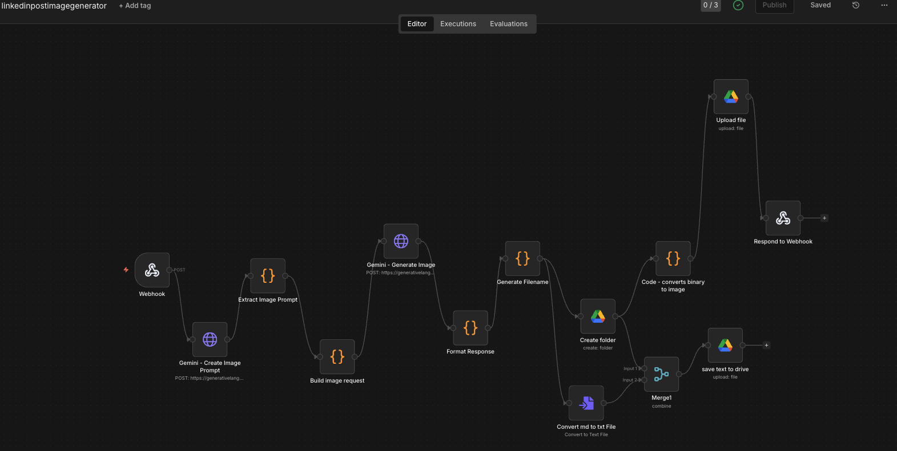
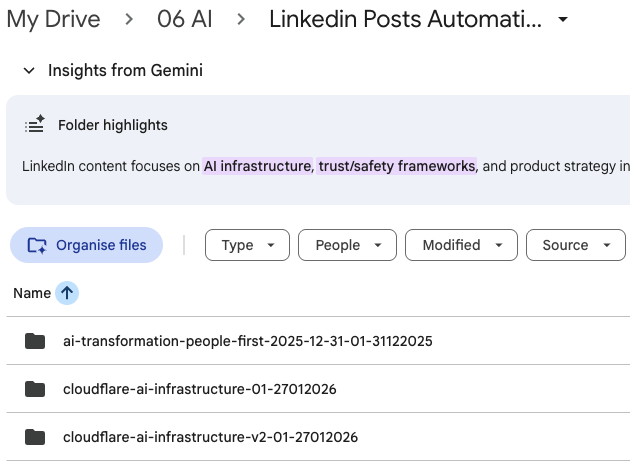

# LinkedIn Post Automation

An AI-powered system that generates viral LinkedIn posts and accompanying images from trending news topics.

## What it does

1. Takes a trending topic or news article as input
2. Guides you through framing your perspective (stance, lens, key takeaway)
3. Generates a LinkedIn post using proven viral frameworks
4. Validates the post quality using AI evaluation (LLM-as-judge)
5. Creates an AI-generated image via Google Gemini
6. Saves everything to Google Drive in an organized folder structure

## Screenshots

### n8n Workflow


### Generated Image Example


### Google Drive Output Structure


## Architecture

```
┌─────────────────┐     ┌─────────────────┐     ┌─────────────────┐
│  LLM            │────▶│   n8n Webhook   │────▶│  Google Drive   │
│  (Post Gen)     │     │  (Image Gen)    │     │  (Storage)      │
└─────────────────┘     └─────────────────┘     └─────────────────┘
                               │
                               ▼
                        ┌─────────────────┐
                        │  Google Gemini  │
                        │  (Image API)    │
                        └─────────────────┘
```

## Components

### 1. Post Generation (CURSOR/ANTIGRAVITY/CLAUDE or any LLM)

Generates posts using a training reference of successful LinkedIn creators:
- **L Acosta** - Hook patterns (POV, confession, contrarian)
- **S Bartlett** - Bold predictions, emotional resonance

### 2. AI Evaluation

Every post is validated against 8 criteria before saving:

| Criteria | Pass Condition |
|----------|----------------|
| Hook Pattern | Uses proven pattern (POV/confession/contrarian/results/insider) |
| First Line | Punchy, lowercase, scroll-stopping |
| Line Length | 1-2 sentences max per line |
| Voice | Your perspective, not generic summary |
| Stance | Clear supportive/critical/balanced position |
| Engagement | Ends with a question |
| Hashtags | Includes 3-5 relevant hashtags |
| Takeaway | Has one clear memorable insight |

**Scoring:** 8/8 = ready, 6-7 = auto-revise, <6 = full rewrite

### 3. Image Generation (n8n + Gemini)

An n8n workflow that:
1. Receives the post content via webhook
2. Uses Gemini to generate an image prompt from the post
3. Generates an image using Gemini 2.0 Flash
4. Uploads both post and image to Google Drive

## Setup

### Prerequisites

- [Claude Code OR Any other LLM - deepseek, Gemini ) CLI
- [n8n](https://n8n.io/) (self-hosted or cloud)
- Google Cloud project with:
  - Gemini API enabled
  - Google Drive API enabled
- Google Drive OAuth credentials in n8n

### Configuration

1. **Clone this repo**
   ```bash
   git clone https://github.com/raythanni/linkedin-post-automation.git
   cd linkedin-post-automation
   ```

2. **Import the n8n workflow**
   - Open n8n
   - Import `workflow.json`
   - Update the webhook URL in your environment
   - Add your Gemini API key credentials

3. **Configure webhook URL**

   Replace `YOUR_N8N_DOMAIN` in the workflow with your actual n8n domain:
   ```
   https://YOUR_N8N_DOMAIN/webhook/linkedin-image
   ```

4. **Set up Google Drive**
   - Create a folder structure: `My Drive/06 AI/Linked Posts PM AI/`
   - Connect Google Drive OAuth in n8n

## Usage

### Generate a post

1. Find a trending topic from news sources like:
   - [International Intrigue](https://internationalintrigue.io/)
   - [ts2.tech](https://ts2.tech/)

2. Provide:
   - **Topic/URL** - The news item or trend
   - **Stance** - Supportive, critical, or balanced
   - **Lens** - Prediction, observation, or personal story
   - **Perspective** - Professional, parent, citizen
   - **Key takeaway** - One thing readers should remember

3. Review the generated post and AI evaluation score

4. Approve to save and trigger image generation

### Webhook API

**Endpoint:** `POST https://YOUR_N8N_DOMAIN/webhook/linkedin-image`

**Payload:**
```json
{
  "post_content": "your post text here",
  "filename": "descriptive-filename"
}
```

**Response:**
```json
{
  "success": true,
  "image_base64": "...",
  "image_prompt": "A modern digital illustration...",
  "text_filename": "topic-name-01-27012026",
  "image_filename": "topic-name-01-27012026-image",
  "folder_name": "topic-name-01-27012026"
}
```

## File Structure

```
linkedin-post-automation/
├── README.md                 # This file
├── training-reference.md     # Viral post examples & patterns
├── workflow.json             # n8n workflow (import this)
├── workflow.txt              # Workflow documentation
└── *.md                      # Generated posts
```

### Google Drive Output

```
My Drive/
└── 06 AI/
    └── Linked Posts PM AI/
        └── {topic}-{number}-{ddmmyyyy}/
            ├── {topic}-{number}-{ddmmyyyy}.md
            └── {topic}-{number}-{ddmmyyyy}-image.png
```

## Post Structure

Every generated post follows this framework:

1. **Hook** - Provocative opening line (lowercase, punchy)
2. **Context** - 2-3 sentences of setup
3. **Body** - Key insights with line breaks
4. **Takeaway** - Actionable conclusion
5. **CTA** - Engagement question
6. **Hashtags** - 3-5 relevant tags

## Tech Stack

| Component | Technology |
|-----------|------------|
| Post Generation | Claude (via Claude Code) |
| Image Generation | Google Gemini 2.0 Flash |
| Workflow Automation | n8n (self-hosted) |
| File Storage | Google Drive API |
| Image Prompt Generation | Google Gemini 2.0 Flash |

## Roadmap

- [ ] Automatic LinkedIn posting via API
- [ ] Analytics tracking for post performance
- [ ] A/B testing different hooks
- [ ] Scheduled content calendar
- [ ] Multi-platform support (Twitter/X)

## License

MIT

## Author

Ray Thanni - [@raythanni](https://linkedin.com/in/raythanni)
